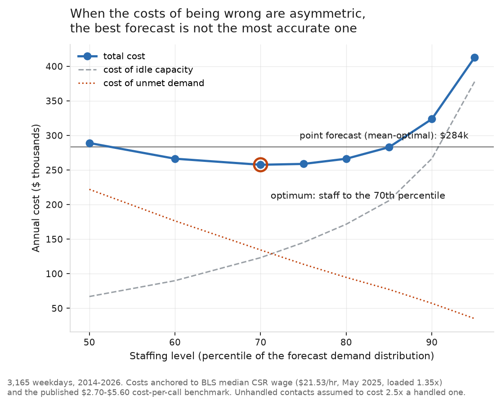
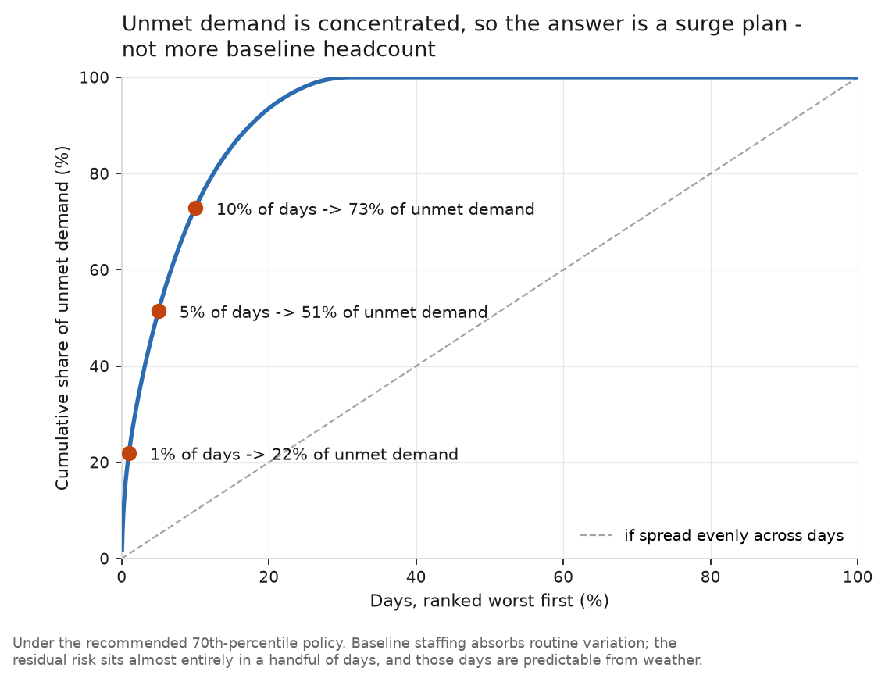
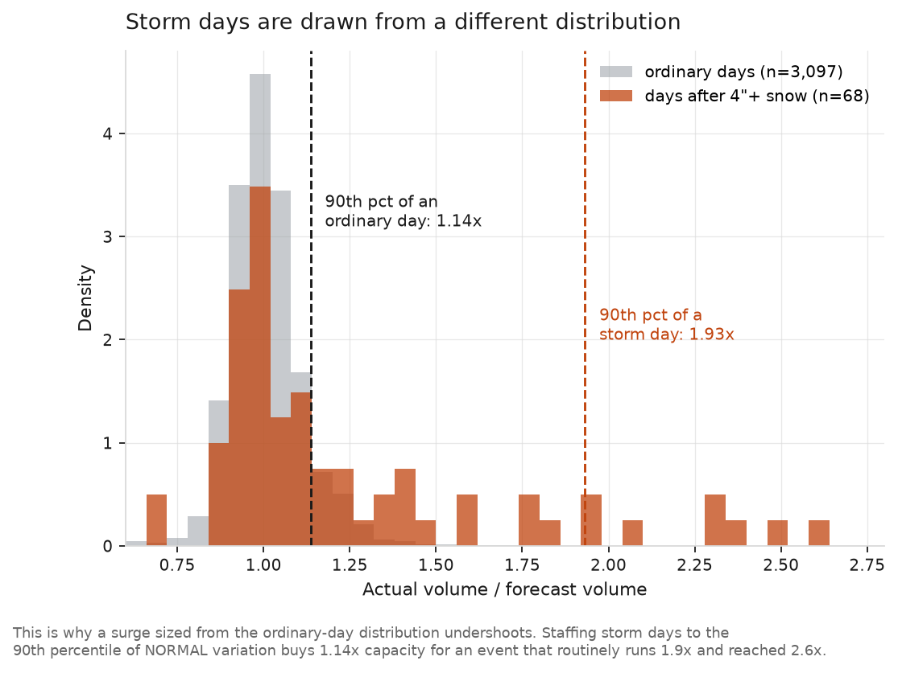

# MC311 Call Center Staffing

**How many agents should a call center staff each day, when being short costs
more than being overstaffed?**

Montgomery County, Maryland runs a 311 center that takes about 1,700 phone
contacts on a typical weekday. I used 14 years of their call data to answer a
staffing question, then checked whether weather forecasts could help on the
worst days.

**The short version:** staffing to the 70th percentile of forecast demand
instead of the average saves about $26,000 a year and cuts missed contacts by
38%. Adding a snow-triggered surge cuts shortfall on storm days roughly in half
at no extra cost.

| | |
|---|---|
| **Data** | 6.5M phone contacts, 2012-2026, plus daily weather |
| **Method** | Quantile forecasting, newsvendor cost model, rolling-origin validation |
| **Result** | $26K/year, 38% fewer missed contacts |
| **Caveat** | Cost figures are industry benchmarks, not this county's actuals. Every result is tested across a range of them. |

Technical detail lives in [METHODS.md](METHODS.md).

---

## Why the average forecast is the wrong target

Most forecasting work optimizes for accuracy. That is the wrong goal here,
because the two ways of being wrong don't cost the same.

An idle agent costs a day's wages. An unhandled contact costs a callback, a
frustrated resident, and a second call tomorrow. When those costs differ, you
shouldn't staff to expected demand. You should staff above it, and exactly how
far above is a calculation, not a guess.

The two dashed lines are the argument. Staff up and idle time gets expensive.
Staff down and missed contacts get expensive. Total cost bottoms out where they
cross, at the 70th percentile. The horizontal line is what the accuracy-optimal
forecast costs. It sits $26,000 higher.

The theory says the optimum should be the 71st percentile. The data says the
70th. That agreement is a good sign the model is doing what it claims.

## What it costs to be wrong

I used published benchmarks rather than invented numbers:

| Input | Value | Source |
|---|---|---|
| Agent wage | $21.53/hour | BLS median for customer service reps, May 2025 |
| Loaded cost | 1.35x wage | Standard benefits and overhead |
| Cost per contact | $4.15 | Midpoint of published $2.70-$5.60 industry range |
| Unhandled contact | 2.5x a handled one | Base case, tested from 1x to 6x |

That last row is the assumption anyone would argue with, so here is what
happens when you change it:

| If an unhandled contact costs... | Best policy | Annual saving |
|---|---|---|
| The same as a handled one | 50th percentile | **-$817** |
| 2x | 70th percentile | $10,328 |
| **2.5x (base case)** | **70th percentile** | **$26,468** |
| 4x | 80th percentile | $89,979 |
| 6x | 85th percentile | $193,972 |

The recommendation holds across the range. Note the first row: when the costs
are equal, this whole approach loses money. That is the honest boundary on it.

## "We'd be short 31% of days" sounds worse than it is

Under the recommended policy, about a third of days end up with some unmet
demand. That number alarms people, and it shouldn't.

On a typical short day, the gap is 99 contacts. That is under two agents. The
90th percentile is 6.5 agents.

More importantly, the problem isn't spread out:

Half of all missed contacts come from 5% of days. Normal staffing handles
normal variation fine. The risk sits in a handful of bad days, which means the
fix is a surge plan for those days, not permanent headcount you pay for all
year.

## The bad days are snowstorms

Every one of the ten worst days in 14 years was a winter storm. January runs
short on 47% of days. October runs short on 7%.

Snow shows up 11 times more often before an extreme day than you'd expect by
chance. That makes it a usable trigger, because snow gets forecast a day or two
ahead.

Two things surprised me:

**Snow on the day itself predicts *fewer* calls.** During the storm the county
closes and nobody calls. The demand shows up when they reopen and stays high for
most of a week. When a 14-inch storm hit on a Saturday in January 2016, the call
surge ran Monday through Thursday. So the right signal is snow over the past
five to seven days, not today's snow.

**The threshold is 8 inches, not 4.** I picked 4 inches to start with because it
sounded like a lot of snow. At 4-8 inches, call volume is basically normal. Above
8 inches, it nearly doubles. The data corrected the guess.

## Why a normal surge isn't big enough

The obvious move is to staff storm days to a high percentile. I tried the 95th.
It still left an average gap of 299 contacts and only covered two thirds of
storm days.

The reason is in the chart. A percentile calculated from all days describes
normal variation, and normal variation tops out around 1.14x the forecast. Storm
days routinely run 1.9x and one hit 2.6x. You're using the wrong distribution.

The fix is to size the surge from previous storms instead:

| Approach | Storm days covered | Average gap | Annual cost |
|---|---|---|---|
| Normal staffing (70th pct) | 48% | 7.4 agents | $257,608 |
| Permanently staff higher (90th pct) | 60% | 6.2 agents | $323,716 |
| Surge to 95th pct on snow | 66% | 5.4 agents | $255,219 |
| **Size the surge from past storms** | **75%** | **3.5 agents** | **$254,548** |

Coverage goes from 48% to 75% and the gap halves. Total cost barely moves, which
is worth saying plainly: 68 storm days out of 3,165 can't shift an annual budget
much. **The value is service on the days people remember, not savings.** For
comparison, buying similar coverage by permanently staffing higher costs $66,000
more a year.

**One honest limit:** I used actual weather, not forecast weather. So this shows
what a perfect forecast would be worth, which is a ceiling, not a delivered
number. Big snowstorms are forecast well 24-48 hours out, so the real number
should be close, but I haven't proven that.

## Recommendation

1. **Staff to the 70th percentile** of forecast daily demand. About $26,000 a
   year, 38% fewer missed contacts.
2. **Add a snow surge** at 8+ inches over five days, sized from past storms.
   Fires about 5 days a year and halves the shortfall on those days.
3. **Revisit above a 4x cost ratio.** At that point permanent capacity beats
   surging and the recommendation changes.

## Things I found along the way

- **Call volume is falling**, 2,040/day in 2012 to about 1,500 in 2025, as the
  web absorbs routine requests. The share of phone calls that create a service
  request rose from 18% to 36%. The easy calls left. The hard ones stayed.
- **No COVID dip.** 2020 volume was up 1.8% on 2019.
- **A field that looked useful and wasn't.** The dataset flags whether each
  request met its service-level target, which looked like a perfect way to price
  the cost of being understaffed. It isn't. That flag measures whether
  *departments* finish the work, not whether the call center answers the phone.
  Tree Maintenance has a 245-day window and misses it 31% of the time. That's
  the roads department not removing stumps. No amount of call center staffing
  changes it.

## Limitations

- Actual weather stands in for forecast weather, so surge results are a ceiling.
- Handle time is assumed constant at 55 contacts per agent-day. The rising
  complexity of calls suggests it isn't.
- Cost inputs are industry benchmarks, not this county's actuals.
- This sets a daily headcount. Real scheduling also needs an intraday arrival
  curve.

## Reproducing

    conda create -n mc311 python=3.12 -y
    conda activate mc311
    pip install pandas pyarrow requests matplotlib scikit-learn

Everything is fetched by script. Nothing is downloaded by hand.

    python src/fetch_daily.py        # MC311 call data
    python src/fetch_weather.py      # daily weather
    python src/build_series.py       # daily series + diagnostics
    python src/baselines.py          # cleaning + baseline forecasts
    python src/staffing_model.py     # quantile forecasts + cost model
    python src/shortfall_profile.py  # where the shortfall concentrates
    python src/weather_response.py   # how volume responds to weather
    python src/weather_policy.py     # surge policies
    python src/storm_model.py        # storm-conditional staffing
    python src/make_charts.py        # figures

Data from the [Montgomery County open data
portal](https://data.montgomerycountymd.gov/) and
[Open-Meteo](https://open-meteo.com/).
